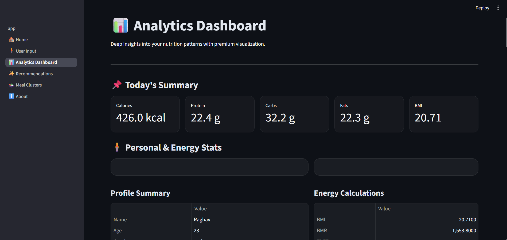
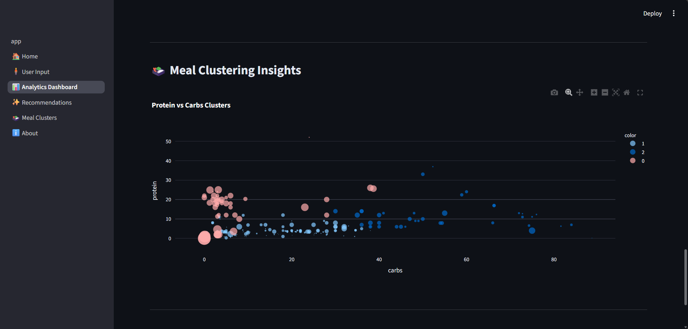
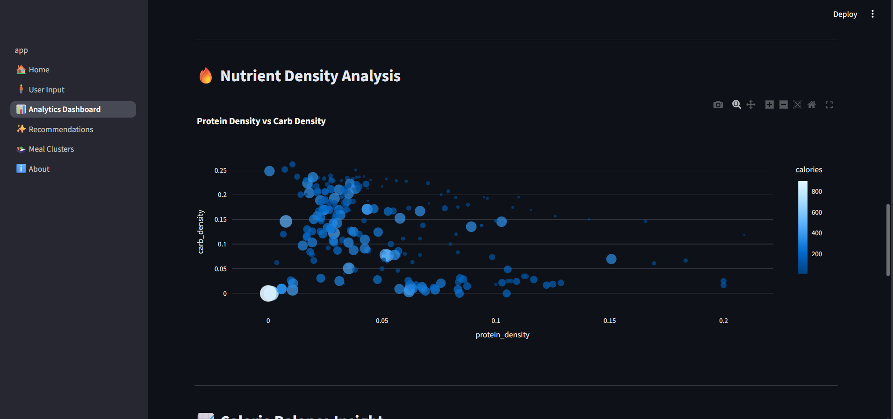
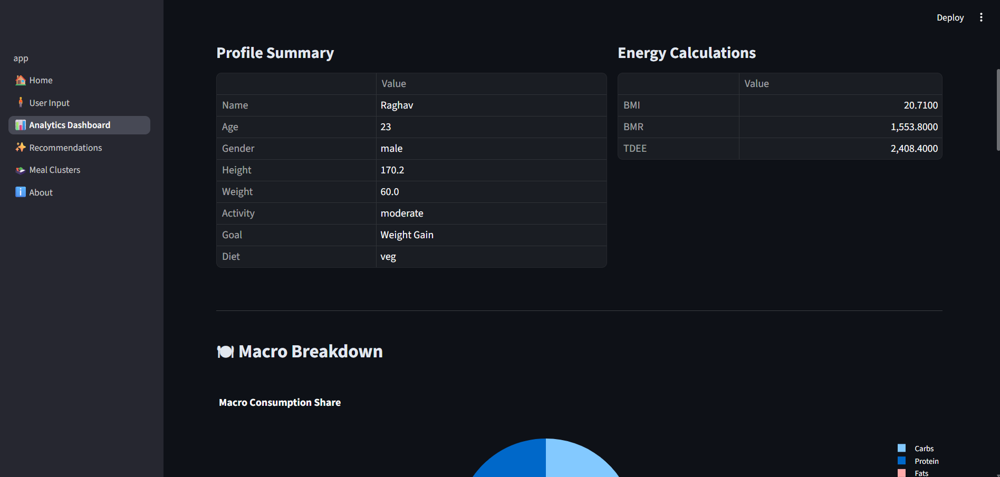

# 🥗 PNARS – Personalized Nutrition Analytics & Recommendation System

> AI-powered personalized nutrition intelligence built using Machine Learning, clustering, and macro-based diet optimization.

---

## 🚀 Overview

PNARS (Personalized Nutrition Analytics & Recommendation System) is an intelligent web-based application that analyzes user health metrics and generates tailored food recommendations and structured meal plans.

It combines nutrition science, machine learning, and explainable scoring logic to deliver personalized insights based on:

- BMR & TDEE calculations
- Goal-based calorie targeting
- Macro distribution optimization
- Content-based similarity filtering
- Indian diet-aware meal heuristics
- Goal alignment scoring

The system integrates rule-based logic with ML-driven ranking for realistic and practical recommendations.

---
## 🏠 PNARS Home Interface

---
## 🧠 Smart User Input Interface

---

# 🖼 Application Preview

## 🔥 Personalized Recommendation Engine (Core Output)

---

## 📊 Analytics Dashboard

---

## 🍱 Meal Clustering Intelligence

---

## 🎯 Key Features

✅ Personalized Calorie Target (BMR + Activity Level)  
✅ Macro Breakdown (Protein, Carbs, Fats)  
✅ Cosine Similarity-Based Food Recommendation Engine  
✅ Indian Diet-Aware Meal Planning (Veg / Vegan / Non-Veg)  
✅ Goal Alignment Score  
✅ Analytics Dashboard with Visual Insights  
✅ Meal Clustering using KMeans  
✅ Automated PDF Report Generation  
✅ Clean Multi-Page Streamlit UI  

---

## 🧠 Machine Learning & Logic Architecture

### 1️⃣ Calorie & Macro Engine
- Uses Mifflin-St Jeor Equation for BMR
- Adjusts for activity level (TDEE)
- Goal-based calorie modification (±300 kcal)
- Macro distribution strategy (30/45/25 split)

---

### 2️⃣ Content-Based Recommender System
- Nutrient feature vector:
  - Calories
  - Protein
  - Carbs
  - Fat
- Cosine Similarity between goal vector and food dataset
- Weighted ranking:
  - 60% similarity score
  - 40% protein-to-calorie efficiency ratio
- Diet filtering (Veg / Vegan / Non-Veg)

---

### 3️⃣ Meal Clustering Model
- KMeans clustering
- Standardized nutritional features
- Structured grouping of food categories
- Used for intelligent meal grouping logic

---

### 4️⃣ Goal Alignment Score
Custom scoring metric based on:
- Calorie deviation from target
- Protein shortfall gap
- Nutritional adherence stability

Produces an interpretable health alignment score (0–100).

---

## 🏗 Project Structure

PNARS-Nutrition-Recommendation-System/
│
├── data/
├── models/
├── pages/
├── src/
├── assets/
├── app.py
├── requirements.txt
└── README.md

---

## 🛠 Tech Stack

- Python
- Streamlit
- Pandas
- NumPy
- Scikit-Learn
- Plotly
- ReportLab
- Cosine Similarity
- KMeans Clustering

---

## 📊 System Workflow

1. User inputs age, weight, height, activity level, diet preference.
2. System calculates BMR and calorie target.
3. Macro targets are computed dynamically.
4. Recommendation engine filters dataset by diet type.
5. Cosine similarity ranks food items.
6. Meal plan is generated using Indian heuristic keyword logic.
7. Goal alignment score evaluates nutritional adherence.
8. Dashboard visualizes macro and calorie analytics.
9. PDF report summarizes results.

---

## ▶️ Run Locally

Clone the repository:

git clone https://github.com/RaghavSharma1008/PNARS-Nutrition-Recommendation-System.git
cd PNARS-Nutrition-Recommendation-System

Install dependencies:
pip install -r requirements.txt

Run the application:
streamlit run app.py

---

## 🌐 Deployment

Designed for deployment on:

- Streamlit Cloud
- Render
- Railway

(Deployment link coming soon)

---

## 📌 Future Improvements

- Deep learning-based recommendation engine
- Real-time nutrition API integration
- User authentication & data persistence
- Cloud model storage
- Database integration (PostgreSQL / MongoDB)
- Mobile-responsive UI optimization

---

## 👨‍💻 Author

Raghav Sharma  
Data Science | Machine Learning | Python Developer  

---

⭐ If you found this project valuable, consider giving it a star.
